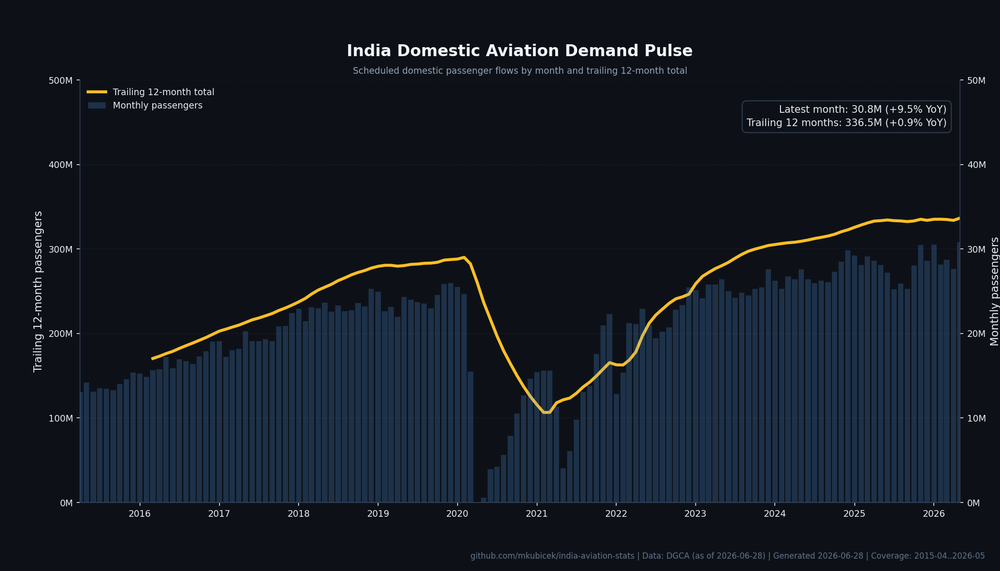
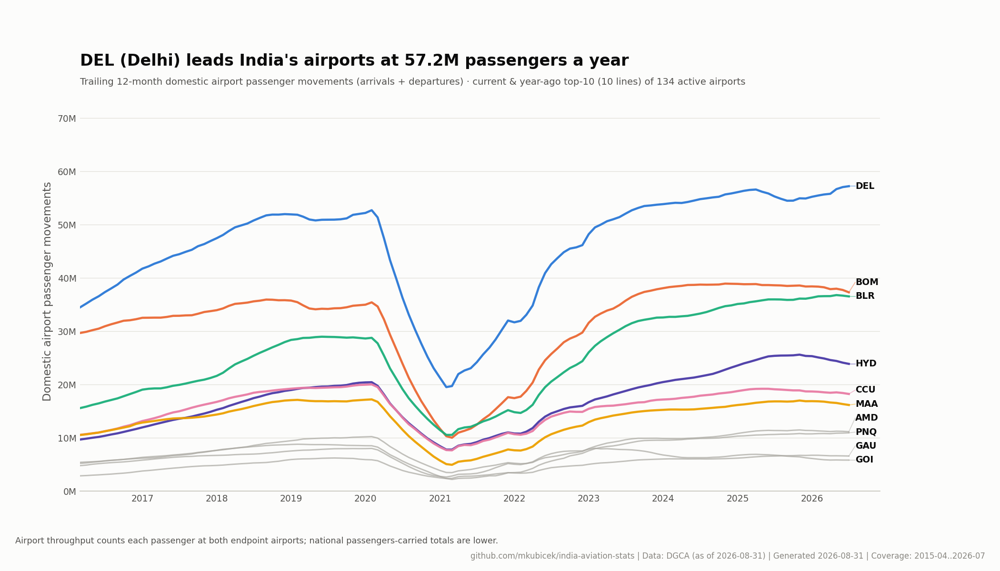
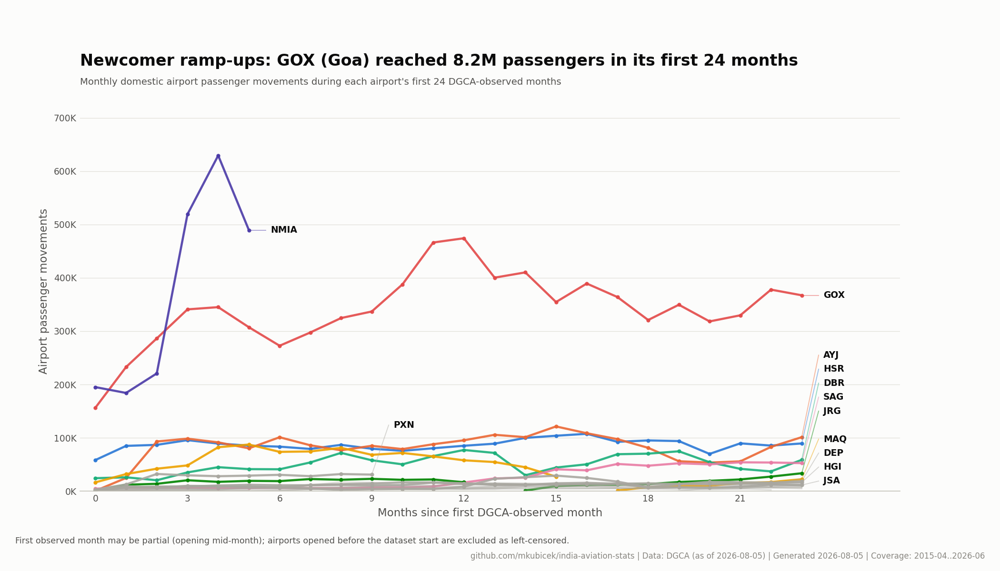
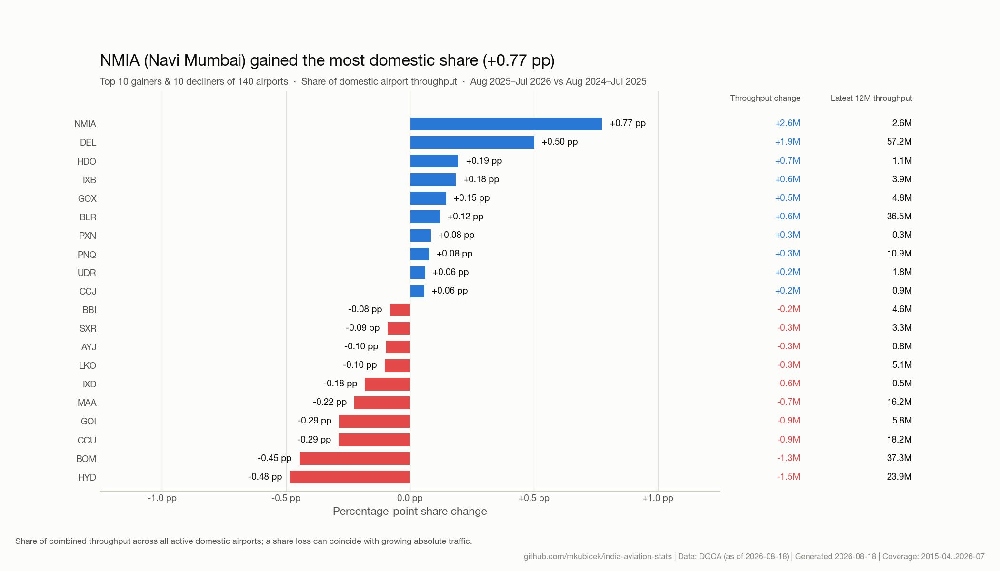
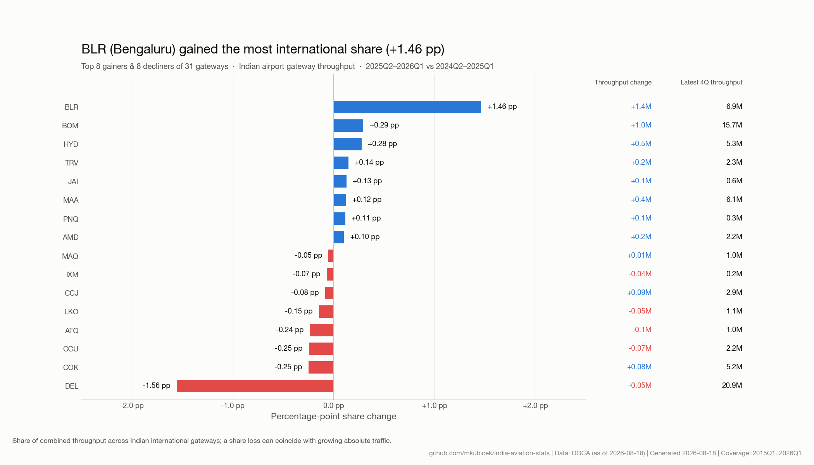
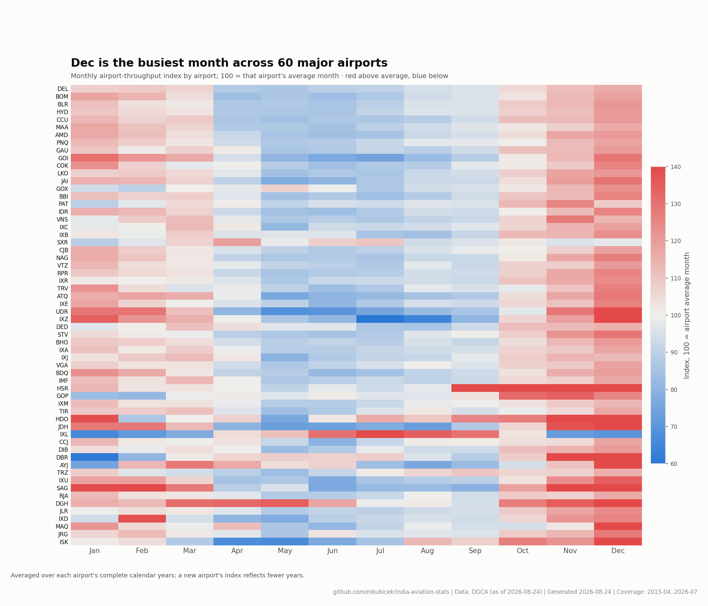
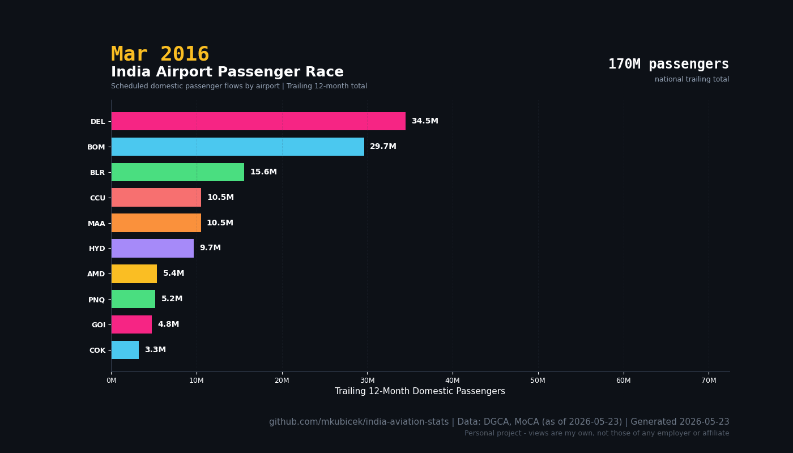

# India Aviation Stats

A clean, continuous, openly-licensed dataset of Indian aviation passenger
traffic - DGCA's messy public workbooks turned into tidy CSVs you can `curl` and
trust, **with the proof that the cleaning is correct shipped alongside the data.**

**Live dashboard:** <https://mkubicek.github.io/india-aviation-stats/>

> **Disclaimer:** This is a personal open-source project. Views and analysis
> are my own and do not represent Flughafen Zürich AG, Noida International
> Airport, or any affiliated entity.

## The data

Four single-grain tables (three source + one derived) in [`data/processed/`](data/processed/) - full schema
in the **[data dictionary](docs/data-dictionary.md)**:

| Table | Grain | Scope |
|---|---|---|
| `airport_monthly.csv` | airport × month | domestic - the canonical core |
| `airport_international_quarterly.csv` | airport × quarter | international |
| `carrier_monthly.csv` | airline × service × month | airline operating stats |
| `airport_yearly.csv` | airport × year | **derived** from the monthly + quarterly tables |

Each airport is **one entity** (`passengers == departures + arrivals`, integer),
each file has **one time grain** - so you can `groupby` any way and never get a
silently-wrong number. Stable per-file URLs to `curl` or cite:

```
https://raw.githubusercontent.com/mkubicek/india-aviation-stats/main/data/processed/airport_monthly.csv
```

## How the cleanup is validated

DGCA's workbooks are genuinely messy (a `PASSENEGER` header typo, shifting S3
keys, 2-digit years, the same airport under several spellings). Every cleanup
decision is **checkable and re-run on every refresh**, because a naive heuristic
would silently corrupt the data:

- **Goa is two airports.** Dabolim (`GOI`) and Mopa (`GOX`, opened 2023) - and
  DGCA files Mopa's traffic under *Dabolim's* IATA code. Merging them erases an
  airport; trusting the code mislabels one. Resolved by cited research, encoded
  with validity windows.
- **The overlap gate** refuses to sum two concurrent source labels into one
  airport unless a human has declared it - a new DGCA label landing on an
  existing airport reds CI until classified, never silently merges.
- **A falsifiable ledger.** Every non-trivial decision is a static Markdown file
  in [`assumptions/`](assumptions/) (Open Knowledge Format) with evidence,
  citations, and a named falsification test. `validate --assumptions` re-tests
  each against current data → HOLDS/TRIGGERED/STALE/ORPHANED in
  [`DATA_QUALITY.md`](data/processed/DATA_QUALITY.md).

See [METHODOLOGY.md](METHODOLOGY.md) for the validation table. `mappings.yaml` is
the canonical entity table (every source label → airport); `assumptions/` records
the non-trivial cleanup decisions.

## Dashboard

**Live dashboard:** <https://mkubicek.github.io/india-aviation-stats/>

## Charts

Generated from the published tables, no editorial overlays. National domestic
demand uses **scheduled domestic passengers carried** (`carrier_monthly.csv`,
counted once per journey); airport charts use **airport throughput**
(`airport_monthly.csv`, arrivals + departures), which is the correct airport-level
metric and is roughly twice the national passengers-carried figure. Each chart's
source table and metric semantics are recorded in
[`charts/manifest.json`](charts/manifest.json).

### India Domestic Demand Pulse

Scheduled domestic passengers carried, by month and trailing 12-month total.



### Top Airport Traffic Trends

Trailing 12-month domestic airport passenger movements (arrivals + departures).



### Newcomer Airport Ramp-up



### Market Share Movers

Share of domestic airport throughput, and of Indian international gateway throughput.





### Airport Seasonality Fingerprint



### Bonus animation

The passenger race GIF can be regenerated with `uv run python scripts/chart.py --include-gifs`.



## Pipeline

```
fetch → normalize → clean → validate → chart
 (1) fetch DGCA raw   (2) dedup + trace   (3) standardized set   (4) charts
```

```bash
uv sync
uv run python scripts/fetch.py     # download DGCA raw + fingerprint manifest
uv run python scripts/clean.py     # build the canonical tables
PYTHONPATH=scripts uv run python -m validate --assumptions --revisions
uv run python scripts/chart.py     # static dashboard charts + JSON summary
uv run pytest
```

Monthly GitHub Actions refreshes the data behind the validation gate: a blocking
failure keeps the last-good data and opens an issue instead of shipping a
now-wrong merge. Source changes are detected via a committed fingerprint manifest
(`data/sources_manifest.csv`); restated values are disclosed in
[`REVISIONS.md`](data/processed/REVISIONS.md).

## How to cite

> Kubicek, M. (2026). *India Aviation Stats: a cleaned DGCA passenger-traffic
> dataset.* GitHub. https://github.com/mkubicek/india-aviation-stats

## License

MIT - see [LICENSE](LICENSE). Data sourced from DGCA (public).
