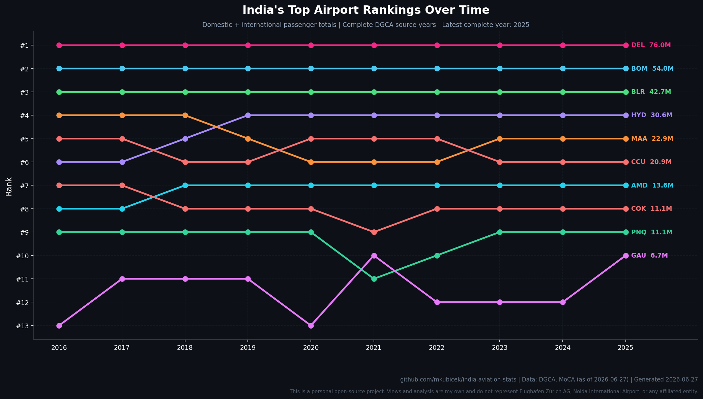

# India Aviation Stats

Open-source tooling for fetching official Indian aviation traffic workbooks,
normalizing them into tidy CSVs, and generating current passenger charts.

> **Disclaimer:** This is a personal open-source project. Views and analysis
> are my own and do not represent Flughafen Zürich AG, Noida International
> Airport, or any affiliated entity.

---

## Current Scope

This branch is intentionally focused on observed source data:

- discover and download DGCA public Excel workbooks directly from source
- normalize domestic monthly and international quarterly traffic tables
- publish processed airport/carrier CSVs
- generate passenger-ranking and trailing domestic passenger-race charts

GDP correlation, passenger projections, milestones, and reports are not part of
`main` right now. The earlier exploratory work remains in `feature/bootstrap`.

---

## Charts

### Passenger Race

Animated bar race of the top airports by scheduled domestic passengers on a
trailing 12-month basis. The current source coverage supports continuous
monthly frames from Mar 2016 through May 2026.


### Airport Rankings

Static bump chart of the current top 10 airports across complete DGCA source
years. Ranking uses domestic + international passenger totals, while incomplete
annual years are left as visible gaps.



---

## Data Sources

| Source | What | Access |
|--------|------|--------|
| [DGCA](https://www.dgca.gov.in/) | Domestic city-pair/carrier workbooks; international city/country/carrier workbooks | Public Excel |
| [MoCA](https://www.civilaviation.gov.in/) | Optional daily summaries | Public HTML / Internet Archive |

`scripts/download.py` discovers DGCA workbook URLs, downloads raw source files
under `data/raw/aviation/dgca/`, and writes normalized aggregate CSVs under
`data/raw/aviation/aggregated/`. Optional MoCA daily snapshot ingestion is
enabled with `INCLUDE_MCA_DAILY=1`.

---

## Pipeline

```
download.py -> process.py -> validate.py -> chart.py
```

Each step is idempotent and can be re-run independently.

```bash
# Setup
uv sync

# Full local refresh
uv run python scripts/download.py
uv run python scripts/process.py
uv run python scripts/validate.py
uv run python scripts/chart.py

# Faster static-chart run
uv run python scripts/chart.py --skip-gifs

# Tests
uv run pytest
```

Monthly CI keeps the source cache fresh and regenerates processed data/charts.
Raw downloads are gitignored and cached in GitHub Actions as a compressed
`data/raw.tar.zst` archive.

---

## Processed Data

| File | Description |
|------|-------------|
| `data/processed/airport_monthly.csv` | Airport passenger rows. Domestic rows are monthly; international rows are quarterly source values mapped to the quarter midpoint month. |
| `data/processed/airport_yearly.csv` | Calendar-year airport passenger totals by category and tier. |
| `data/processed/carrier_monthly.csv` | Domestic carrier source rows normalized from DGCA workbooks. |
| `data/processed/metadata.json` | Processing metadata and data date. |

---

## Project Structure

```
india-aviation-stats/
├── AGENTS.md
├── CHANGELOG.md
├── METHODOLOGY.md
├── README.md
├── TODOS.md
├── LICENSE
├── mappings.yaml
├── scripts/
│   ├── download.py       # Fetch DGCA/MoCA source data
│   ├── ingest_sources.py # Discover, download, and normalize sources
│   ├── process.py        # Build processed CSVs
│   ├── validate.py       # Advisory source/data checks
│   └── chart.py          # Generate charts
├── data/
│   ├── raw/              # Downloaded source files (gitignored)
│   └── processed/        # Published CSVs
├── tests/
├── charts/
├── .github/workflows/
│   ├── update.yml
│   └── cache-keepalive.yml
└── pyproject.toml
```

---

## Release History

See [CHANGELOG.md](CHANGELOG.md).

---

## License

MIT - see [LICENSE](LICENSE).
