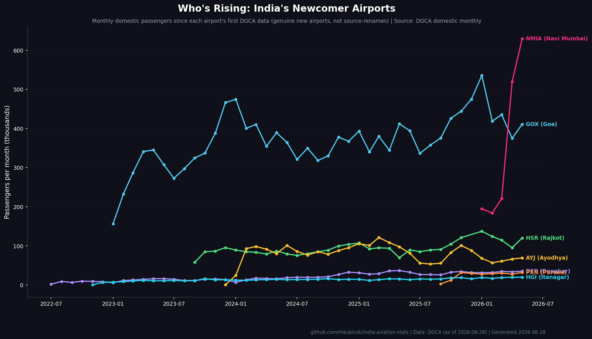

# India Aviation Stats

A clean, continuous, openly-licensed dataset of Indian aviation passenger
traffic — DGCA's messy public workbooks turned into tidy CSVs you can `curl` and
trust, **with the proof that the cleaning is correct shipped alongside the data.**

> **Disclaimer:** This is a personal open-source project. Views and analysis
> are my own and do not represent Flughafen Zürich AG, Noida International
> Airport, or any affiliated entity.

---

## The data

Four single-cadence layers in [`data/processed/`](data/processed/). Full schema
in the **[data dictionary](docs/data-dictionary.md)**.

| Layer | File | Grain | Scope |
|---|---|---|---|
| 1 | `airport_monthly.csv` | airport × month | domestic (canonical core) |
| 2 | `airport_international_quarterly.csv` | airport × quarter | international |
| 3 | `airport_yearly.csv` | airport × year | derived totals |
| 4 | `carrier_monthly.csv` | airline × service × month | airline operating stats |

Stable per-file URLs (use these to cite or `curl`):

```
https://raw.githubusercontent.com/mkubicek/india-aviation-stats/main/data/processed/airport_monthly.csv
```

Each airport is **one entity** (`passengers == departures + arrivals`,
whole-person integers), and each file has **one time grain** — so you can
`groupby` any way and never get a silently-wrong number from cadence mixing or
duplicate-name fragmentation.

---

## How the cleanup is validated

DGCA's workbooks are genuinely messy (a `PASSENEGER` header typo, shifting S3
keys, 2-digit years, the same airport under several spellings). The distinctive
move here is that **every cleanup decision is checkable and re-run on every
refresh**, because a naive heuristic would silently corrupt the data:

- **Goa is two airports.** Dabolim (`GOI`) and Mopa (`GOX`, opened 2023) — and
  DGCA files Mopa's traffic under *Dabolim's* IATA code. Merging them erases an
  airport; trusting the code mislabels one. Resolved by cited research, encoded
  with validity windows.
- **The overlap gate** refuses to sum two concurrent source labels into one
  airport unless a human has declared it — so a new DGCA label that lands on an
  existing airport reds CI until classified, never silently merges.
- **A falsifiable ledger.** Every non-trivial decision is a static Markdown file
  in [`assumptions/`](assumptions/) (Open Knowledge Format) with evidence,
  citations, and a named falsification test. `validate --assumptions` re-tests
  each one against the current data and reports
  HOLDS/TRIGGERED/STALE/ORPHANED in
  [`DATA_QUALITY.md`](data/processed/DATA_QUALITY.md).

```bash
# run the full validation gate + assumptions ledger + revision log
PYTHONPATH=scripts uv run python -m validate --assumptions --revisions
```

See [METHODOLOGY.md](METHODOLOGY.md) for the full validation table and
[`docs/airport-mapping-audit.md`](docs/airport-mapping-audit.md) for how every
airport label was resolved.

---

## Charts

Two curated charts, generated from the published layers with no editorial data.

**Passenger Race** — animated bar race of top airports by trailing 12-month
domestic passengers.


**Who's Rising** — monthly ramp curves of genuine newcomer airports (Navi
Mumbai, Mopa, Ayodhya…). Because it sources the deduplicated Layer 1, it shows
real new airports, never source-renames. Noida International (NIA) is highlighted
gold and appears automatically once DGCA publishes it.



---

## Pipeline

```
fetch.py  ->  normalize.py  ->  clean.py  ->  validate/  ->  chart.py
 (1) get      (1) Excel→CSV    (2) entity    (2) checks +   (4) charts
                               dedup +        ledger +
                               cadence split  revisions
```

```bash
uv sync                                            # setup
uv run python scripts/fetch.py                     # download + fingerprint sources
uv run python scripts/clean.py                     # build the canonical layers
PYTHONPATH=scripts uv run python -m validate --assumptions --revisions
uv run python scripts/chart.py                     # (--skip-gifs for fast static)
uv run pytest                                      # tests
```

Monthly GitHub Actions refreshes the data behind the validation gate: a BLOCKING
failure keeps the last-good data and opens an issue instead of shipping a
now-wrong merge. Source changes are detected via a committed fingerprint manifest
(`data/sources_manifest.csv`) and restated values are disclosed in
[`REVISIONS.md`](data/processed/REVISIONS.md).

---

## How to cite

> Kubicek, M. (2026). *India Aviation Stats: a cleaned DGCA passenger-traffic
> dataset.* GitHub. https://github.com/mkubicek/india-aviation-stats

```bibtex
@misc{kubicek_india_aviation_stats,
  author = {Kubicek, Marek},
  title  = {India Aviation Stats: a cleaned DGCA passenger-traffic dataset},
  year   = {2026},
  howpublished = {\url{https://github.com/mkubicek/india-aviation-stats}},
  note   = {Source: DGCA / MoCA}
}
```

---

## Project structure

```
india-aviation-stats/
├── mappings.yaml             # airport + airline entity tables (canonical <-> variants)
├── scripts/
│   ├── fetch.py              # (1) download all DGCA raw + fingerprint manifest
│   ├── normalize.py          # (1) Excel -> aggregated CSVs (PASSENEGER fix, month map)
│   ├── clean.py              # (2) entity dedup + cadence split -> published layers
│   ├── manifest.py           # (1) sources_manifest fingerprints (change detection)
│   ├── validate/             # (2) checks.py · overlap · assumptions · revisions
│   └── chart.py              # (4) race + risers charts
├── assumptions/              # (2) OKF cleanup knowledge base (browsable on GitHub)
├── data/
│   ├── sources_manifest.csv  # (1) committed source fingerprints
│   ├── raw/                  # (1) downloaded source files (gitignored, CI-cached)
│   └── processed/            # (3) published CSVs + DATA_QUALITY.md + REVISIONS.md
├── docs/data-dictionary.md
├── charts/
└── .agents/skills/           # harness-agnostic skills (validate-assumptions)
```

---

## License

MIT — see [LICENSE](LICENSE). Data sourced from DGCA and MoCA (public).
