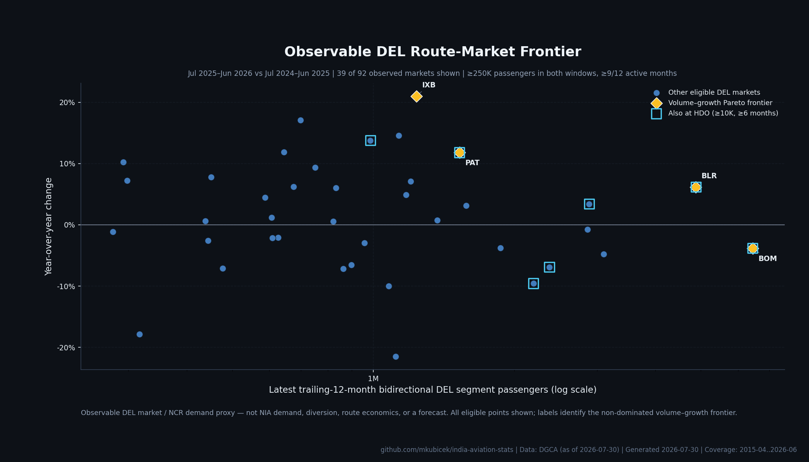
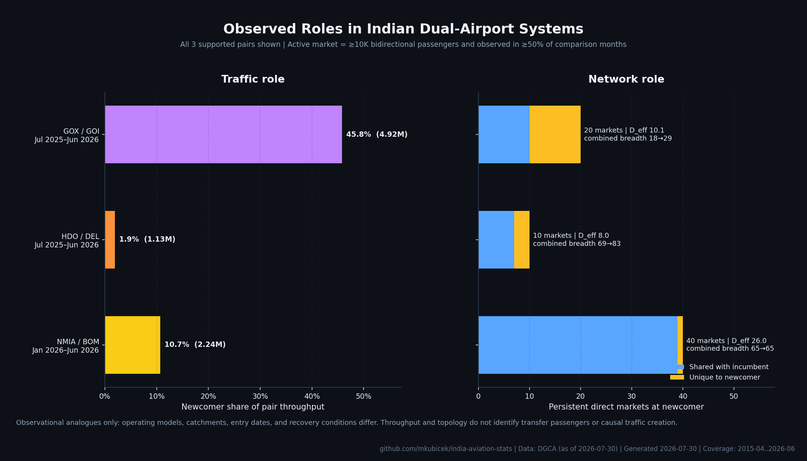
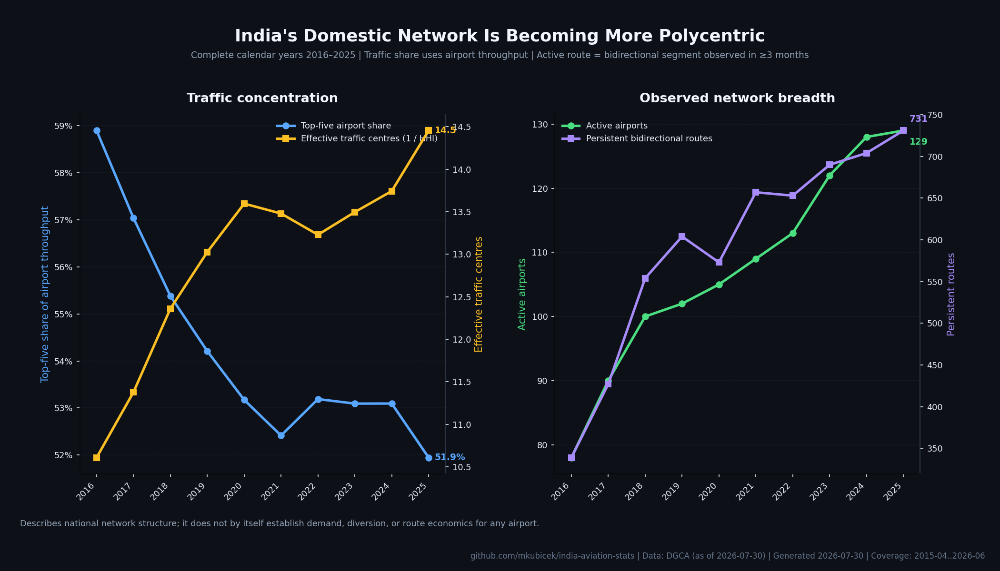

# Noida route-network analysis

> **Disclaimer:** This is a personal open-source project. Views and analysis
> are my own and do not represent Flughafen Zürich AG, Noida International
> Airport, or any affiliated entity.

## Executive conclusion

The strongest thesis is **observable route-market volume, refined by persistent
growth and portfolio balance**. The DGCA data supports a transparent business-
development funnel built from large DEL–destination passenger pools, their
growth, persistence, and volatility. It does **not** support turning those pools
into NIA forecasts or route recommendations without catchment, schedule,
capacity, fare, and airline-economics data.

The dual-airport evidence is useful but secondary. GOX/GOI, HDO/DEL, and
NMIA/BOM demonstrate several possible newcomer roles, from differentiated
network expansion to near-complete replication of the incumbent network. The
shared pattern is consistent with an initial **origin/destination role**, not
evidence that a newcomer is a transfer hub. For NIA, that makes a
complementary-NCR posture more defensible than a structural one-stop thesis.

The live June 2026 source refresh also changes the factual starting point: DXN
now has one partial observed month, not zero rows. DGCA reports 20,058 airport
passenger movements across six domestic markets in June 2026. NIA's public
opening notice says commercial operations began on 15 June, so this is a
partial opening month and is not evidence of steady-state performance
([DXN cleanup decision and sources](../assumptions/DXN-001.md)).

## Quantitative findings

All route-market comparisons use the latest trailing 12 months,
**July 2025–June 2026**, against **July 2024–June 2025**. A route-market
passenger is an observed passenger on either direction of a DGCA domestic
segment, counted once on that segment.

1. DEL had **92 observed domestic markets** in the latest window. Requiring at
   least 250,000 bidirectional passengers in both windows and activity in at
   least 9 of the latest 12 months left **39 eligible markets**.
2. Four markets were non-dominated on both latest volume and year-over-year
   growth:
   - **BOM:** 6.450 million, **−3.8%** year over year
   - **BLR:** 4.876 million, **+6.2%**
   - **PAT:** 1.527 million, **+11.8%**
   - **IXB:** 1.235 million, **+21.0%**
3. The four-market frontier is unchanged at 250,000 and 500,000 passenger
   floors and at 6, 9, or 12 months of required persistence. At a 100,000
   floor, smaller fast-growing markets enter the frontier, so that lower
   threshold is materially more sensitive.
4. In July 2025–June 2026, HDO represented **1.95%** of combined DEL/HDO
   domestic throughput. It had 10 persistent direct markets: **7 shared** with
   DEL and **3 unique** under the disclosed threshold. This is evidence that a
   small secondary airport can combine trunk overlap with a limited distinct
   network; it is not an estimate of NIA's share.
5. The analogues are not interchangeable. GOX held **45.8%** of GOI/GOX
   throughput and split its 20 persistent markets into 10 shared and 10 unique.
   In NMIA's first six observed months, it held **10.7%** of BOM/NMIA
   throughput and 39 of its 40 persistent markets were shared with BOM.
6. The national network became less concentrated between complete calendar
   years 2016 and 2025: top-five airport share fell from **58.9% to 51.9%**,
   effective traffic centres rose from **10.6 to 14.5**, active airports rose
   from **78 to 129**, and persistent bidirectional routes rose from **339 to
   731**. This is supportive context for another NCR airport, not route-level
   demand evidence.

The complete machine-readable results, including sensitivities and discarded
tests, are in
[`route_analysis_summary.json`](../data/processed/route_analysis_summary.json).

## 1. Observable NCR route-opportunity frontier



**Source:** `data/processed/domestic_route_monthly.csv` and
`airport_monthly.csv`.

**Selection:** all 39 of 92 latest-window DEL markets that recorded at least
250,000 bidirectional passengers in each comparison window and were active in
at least 9 latest-window months. The chart labels the volume-growth Pareto
frontier; it does not hide eligible markets behind a top-N cut.

This view separates four useful archetypes without an arbitrary score:

- **Scale anchors:** BOM and BLR offer the largest observable DEL passenger
  pools, but their current directions differ. BOM is a large, mature/declining
  market in this comparison; BLR combines scale with growth.
- **Persistent growth markets:** PAT and IXB sit on the frontier. IDR
  (1.133 million, +14.6%) and VNS (0.985 million, +13.8%) are examples of
  sizeable growing markets that may add portfolio balance even though another
  market dominates them on the two plotted dimensions.
- **Already demonstrated at HDO:** the outlined markets recorded at least
  10,000 bidirectional passengers and six active months at HDO in the latest
  window. This is evidence about route existence at a second NCR airport, not
  proof that DXN would reproduce HDO's traffic.
- **Mature or declining markets:** large negative-growth markets remain
  commercially relevant as observable pools, but their direction argues for a
  different validation question from a fast-growing market.

The underlying analysis also computes three-year comparable-period growth,
positive-month persistence, monthly coefficient of variation, destination
traffic, direct-market breadth, effective destinations, HDO presence, and
great-circle distance where coordinates exist. They remain separate dimensions
rather than being collapsed into a score.

### Implication for NIA

Use the frontier as a **research queue**, not a route list:

1. validate anchor markets such as BLR and BOM with east-NCR catchment and fare
   evidence;
2. test whether PAT and IXB growth is addressable from DXN rather than simply
   observable at DEL;
3. use persistent secondary-city markets to test portfolio diversification;
4. treat declining or volatile markets as requiring a different commercial
   case, even when their absolute pools are large.

## 2. Dual-airport network roles



**Source:** `data/processed/domestic_route_monthly.csv` and
`airport_monthly.csv`.

**Selection:** all three mapped Indian pairs with observed newcomer traffic and
a defensible same-market incumbent. An active direct market has at least 10,000
bidirectional passengers and appears in at least half the comparison months.
GOX/GOI and HDO/DEL use July 2025–June 2026; NMIA/BOM uses its six available
months, January–June 2026.

The chart distinguishes:

- newcomer share of pair airport throughput;
- shared and newcomer-unique persistent destinations;
- effective destinations,
  \(D_\mathrm{eff}=\exp(-\sum_j p_j\ln p_j)\);
- combined-market breadth now versus the equal-length pre-entry incumbent
  baseline.

The machine-readable analysis also publishes a continuous monthly series for
each pair from 12 months before newcomer entry through June 2026. Every row
keeps incumbent, newcomer, and combined airport throughput plus newcomer share
separate, so the observed development can be inspected without treating entry
as the cause of the change.

Combined persistent breadth moved from 18 to 29 markets for GOI/GOX, from 69 to
83 for DEL/HDO, and remained 65 for BOM/NMIA. Those before/after comparisons
are observational: calendar periods, operating models, catchments, airline
strategies, and recovery conditions differ. They are not causal estimates of
traffic creation.

| system | equal-length pre-entry incumbent baseline | observed comparison | combined throughput | persistent breadth |
|---|---|---|---:|---:|
| GOI/GOX | Jan–Dec 2022 | Jul 2025–Jun 2026 | 7.536M → 10.736M (+42.5%) | 18 → 29 |
| DEL/HDO | Oct 2018–Sep 2019 | Jul 2025–Jun 2026 | 50.996M → 58.170M (+14.1%) | 69 → 83 |
| BOM/NMIA | Jul–Dec 2025 | Jan–Jun 2026 | 19.043M → 20.932M (+9.9%) | 65 → 65 |

For the mature GOX and HDO systems, the current window is years after entry,
not an immediate post-entry window. National growth, COVID-19 disruption, and
other market changes are inseparable from airport entry in this comparison.

Sensitivity tests vary the market floor from 5,000 to 50,000 passengers and
the persistence requirement from 25% to 75% of comparison months. Exact counts
move, but the qualitative distinction survives: GOX retains 3–10 unique
markets, NMIA retains 0–1, and HDO retains 1–3.

### Why these are imperfect NIA analogues

- GOX and GOI serve a tourism-heavy state with different geography, ownership,
  and airline allocation from the NCR.
- HDO is the closest regional topology but has a small observed share, a
  first-24-month history disrupted by COVID-19, and a different catchment and
  operating model.
- NMIA is contemporary but has only six observed months and currently displays
  strong overlap with BOM.

The analogues therefore bound plausible roles; they do not identify which role
NIA will take.

## 3. National network decentralisation



**Source:** `data/processed/domestic_route_monthly.csv` and
`airport_monthly.csv`.

**Selection:** every complete calendar year from 2016 through 2025. A
persistent bidirectional route is observed in at least three months of that
year. Traffic concentration uses airport endpoint throughput.

The direction is clear: traffic and route breadth are spreading across more
centres. The conclusion is also limited. National polycentric growth makes an
additional NCR airport more structurally plausible, but does not say which DXN
routes are addressable or profitable.

The machine-readable annual series additionally retains traffic HHI, median
direct and effective destinations, and route births, deaths, and year-over-year
survival. These diagnostics were tested but kept out of the chart when they did
not improve the headline interpretation.

## Candidate theses tested

| thesis | result | reason |
|---|---|---|
| Volume-first route development | **Strongest, retained** | Directly observable, stable under the production thresholds, and readily translated into market-validation questions. |
| Growth and portfolio diversification | **Retained within the frontier** | Growth and persistence distinguish markets that a pure volume ranking would hide; no composite score is needed. |
| Complementary secondary-airport role | **Retained as observational context** | The three analogues show shared trunk markets plus varying differentiation, but do not identify causality or NIA diversion. |
| Traffic hub vs network hub | Not retained as a headline | Latest-window traffic and effective destinations have a Spearman rank correlation of 0.864; the view mostly relabels scale and cannot identify transfers. |
| Structural one-stop opportunities | Not retained | DXN has no qualifying persistent legs. DEL produces 253 directional topological paths at the tested proxy threshold (205 with known coordinates and a detour ratio no greater than 1.5; 48 geographically unassessed), but they do not reveal transfer demand, schedules, or reusable leg capacity. |
| Network decentralisation | **Retained as context** | The long-run change is strong and readable, but less actionable than individual route markets. |
| Triangle closure / hub bypass | Not retained | Six routes qualify at a 50,000-passenger floor and none at 100,000, making the result too threshold-sensitive for a headline. |

No PageRank, eigenvector centrality, inverse-volume betweenness, community
detection, or opaque hub score was used.

## Method

### Canonical route layer

Each normalized DGCA domestic city-pair row becomes two directed records:

- `City1 → City2 = PaxToCity2`
- `City2 → City1 = PaxFromCity2`

Both endpoints pass through the same period-aware, table-driven airport
resolver used by the airport layer. Blank one-direction cells mean zero,
duplicate canonical routes are aggregated deterministically, passenger counts
remain integers, and unresolved domestic endpoints block publication. The one
known same-airport source row is excluded through an exact, documented mapping
rule before both layers are built
([HYD-001](../assumptions/HYD-001.md)).

Validation requires unique route keys, canonical distinct endpoints,
non-negative integer passengers, and exact reconciliation for every
airport-month:

```text
sum(outgoing route passengers) = airport_monthly.departures
sum(incoming route passengers) = airport_monthly.arrivals
```

National directed route passengers must also equal national departures and
national arrivals. A history gate blocks unexplained disappearance of a
previously published route-month key.

### Window and metric rules

- Domestic route analyses remain monthly. International quarterly data is not
  mixed into any route calculation.
- Bidirectional market volume is the sum of the two observed directed segment
  records; it is not the sum of airport throughput.
- Latest and prior windows are complete, adjacent, and disjoint.
- The three-year trend compares July 2022–June 2023 with
  July 2025–June 2026; it is computed only from complete 12-month periods.
- A route is persistent in a window for each month with positive observed
  traffic.
- The Pareto frontier maximises only latest volume and year-over-year growth.
  Other diagnostics remain visible for investigation rather than becoming
  hidden weights.
- Structural two-leg paths use the disclosed balanced-leg proxy
  \(B(o,h,d)=\min(P_{o,h},P_{h,d})\). Scores are never summed across paths.

### Geographic coverage

No map was selected because geography did not materially improve the winning
conclusion. In the latest window, configured coordinates cover 67 of 133 active
airports but 96.0% of passenger throughput. Avoiding a map prevents the 66
missing airports from becoming silent visual omissions. Distances are retained
only as an optional frontier diagnostic where both coordinates exist.

## Claim boundaries and data still needed

DGCA segment data establishes observed directional passengers, route existence
and persistence, direct-market breadth, concentration, and topological
two-edge paths. It does **not** establish:

- true passenger origin and final destination;
- transfer volumes or transfer rates;
- timetable or minimum-connection-time feasibility;
- same-airline, interline, codeshare, or baggage compatibility;
- frequency, seats, fares, yields, profitability, or route economics;
- the share of DEL traffic that would use DXN;
- DXN catchment propensity or surface-access trade-offs.

Before a commercial route decision, the frontier needs to be joined to
catchment-level booking/MIDT or ticket-coupon evidence, fares and yields,
schedule and capacity data, airline fleet/network fit, competitive response,
surface access, and airport operating economics. Feasible-connection analysis
also requires schedules, timing, and airline compatibility; actual connecting
flow requires itinerary-level data.

## Reproducibility

Run:

```bash
uv run python scripts/clean.py
PYTHONPATH=scripts uv run python -m validate --assumptions --revisions
uv run python scripts/chart.py
uv run pytest
```

The chart manifest records each chart's source table, metric semantics,
parameters, exact comparison periods, selection rule, shown/eligible counts,
coverage, input fingerprint, and output hash. The processed route table is
durable and committed; chart generation does not depend on the evictable raw
cache.
